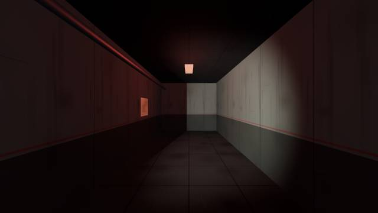
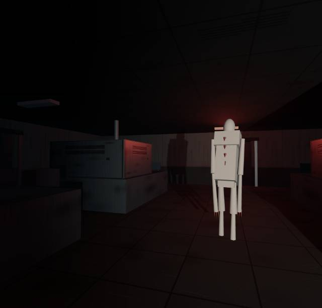
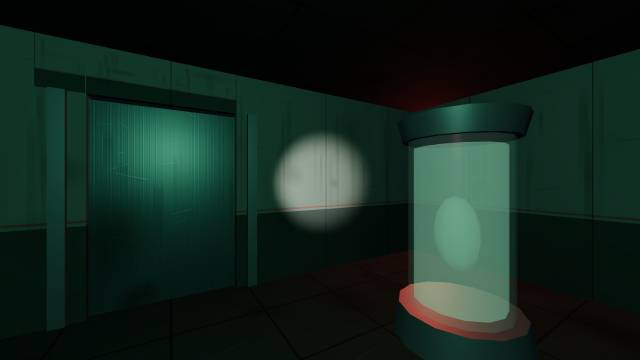

# DESPERATION — Browser Demake

A first-person horror stealth game that runs in the browser. You wake up locked
in a derelict military research facility, and something is awake in there with
you. Restore the power, find the keycards, and get out — without being heard.

This is a [three.js](https://threejs.org/) demake of **Desperation**, originally
built in Unreal Engine 5 for CSE420 (3D Video Game Development). The facility
layout is reconstructed from the original `LabLevel.umap`, so the rooms, doors,
lockers and pickups sit where they sit in the real game.

**▶ [Play in your browser](https://Twen918.github.io/desperation-web/)**
&nbsp;·&nbsp;
[Download the original UE5 game on itch.io](https://chieftain22.itch.io/desperation)

> The play link goes live once GitHub Pages is enabled — see
> [Deploying](#deploying) below.



| | |
|---|---|
|  |  |

---

## Controls

| Key | Action |
|---|---|
| `W` `A` `S` `D` | Move |
| `Mouse` | Look |
| `Shift` | Sprint — fast, but very loud |
| `Shift` + `C` | Slide — short burst, fits under collapsed vents |
| `C` | Crouch — slow and nearly silent |
| `Space` | Jump |
| `E` | Interact / hide in locker / close note |
| `F` | Flashlight — your main light source, but it makes you easier to see |
| `M` | Facility map |
| `Esc` | Pause |

Headphones are strongly recommended. The creature is located by sound long
before you can see it.

## How it plays

**Noise is the core mechanic.** A meter on the HUD tracks how much sound you are
making. Sprinting, sliding, landing a jump and throwing breakers all spike it,
and the creature's hearing radius scales directly with it. Crouching drops you
to almost nothing.

The creature runs a full state machine — dormant, patrol, investigate, chase,
search — with vision cones, line-of-sight checks against the level geometry, and
BFS pathfinding over a hand-authored waypoint graph. It hears breakers, radios
and alarms, and it will search your last known position before giving up.

There is always a way out. The laboratory is a ring around a block of equipment,
and the north half of the facility is a double loop, so you can never be cornered
by geometry alone. Serums cut both ways: **speed** makes you faster and louder,
**regen** buys you one escape from a grab, **suppressor** muffles your steps,
**vision** lets you see the creature on your map but slows you down.

A few tools change the odds. The dormitory **radio** pulls the creature across
the map. The west-wing **fire alarm** rings for eight seconds and buries every
sound you make while it does — including all four breakers, if you time it.

## Two builds

Both are the same game, produced from the same source.

| Build | File | How to run |
|---|---|---|
| **Modular** (ES6 modules) | `index.html` + `js/` + `css/` | Needs a web server — this is what GitHub Pages serves |
| **Single file** | `Desperation-singlefile.html` | Just double-click it. No server, no install |

If you only want to play locally, grab the single-file build. If you want to read
or modify the code, work in `js/`.

Running the modular build locally:

```bash
python -m http.server 8000
# then open http://localhost:8000
```

A server is required because browsers block ES6 module imports over `file://`.

## Project structure

```
index.html                    Modular entry point
Desperation-singlefile.html   Generated single-file build
css/style.css                 All UI and HUD styling
js/
  utils.js                    Math and DOM helpers
  config.js                   Room bounds, waypoint graph, all story text
  state.js                    Shared mutable state and object registries
  audio.js                    Procedural WebAudio engine (no audio files)
  gfx.js                      Renderer, scene, camera
  ui.js                       HUD, objectives, map, notes, overlays
  world.js                    Materials, level geometry, doors, lights,
                              collision, line of sight, pathfinding
  entities/player.js          Movement, crouch, slide, flashlight
  entities/monster.js         Creature AI state machine
  gameplay.js                 Interactables, serums, radio, alarm, events
  gameflow.js                 Capture, jumpscare, respawn, triggers, ending
  main.js                     Input, main loop, boot
tools/build.py                Generates the single-file build and the itch zip
```

**`js/` is the source of truth.** The single-file build is generated from it —
never edit `Desperation-singlefile.html` by hand.

## Building

```bash
python tools/build.py
```

This regenerates `Desperation-singlefile.html` and packs `desperation-web.zip`
for itch.io (which expects a zip containing `index.html` at its root, uploaded
with *"This file will be played in the browser"* checked).

The single-file build works by concatenating the modules in dependency order
with their `import`/`export` statements stripped. There is no bundler and no
`node_modules`; the only dependency is three.js r128 from a CDN.

## Notable implementation details

Everything is procedural — there are **no texture files, no models and no audio
files** in this repository. Wall grime, floor tiles, locker panels and blood are
drawn into canvases at load time; footsteps, the creature's growls, the fire
alarm, the radio static and the jumpscare are synthesized with WebAudio
oscillators and filters.

Collision is circle-vs-AABB pushout against a single wall list that also serves
line-of-sight raycasts and the in-game map, so the physics, the AI's vision and
the map can never disagree with each other.

## Deploying

To publish the playable link:

1. Push this repository to GitHub as a **public** repo named `desperation-web`.
2. **Settings → Pages → Source: Deploy from a branch**, branch `main`, folder `/ (root)`.
3. Wait a minute for the first build. The play link at the top of this README
   then works. (If you name the repo something other than `desperation-web`,
   update both links to match.)

The single-file build is also served, at
`https://Twen918.github.io/desperation-web/Desperation-singlefile.html`.

## Credits

Original Unreal Engine 5 game — CSE420 team:

- **Yiwen Tan** — interaction systems, colour-coded keys and doors, flashlight, inspection system
- **Longyu Lin** — monster AI, hiding systems, death sequences
- **Torin Sheahen** — movement system, syringes, level design, UI, sound, story
- **Ruoer Xu** — environment and puzzle systems, main level layout, buff UI

Browser demake built with Claude Code.

## License

The source code in this repository is released under the MIT License — see
[LICENSE](LICENSE).

The game's story, characters, written notes and level design belong to the
original team and are **not** covered by that license. Please don't reuse the
narrative content or ship the game as your own.
